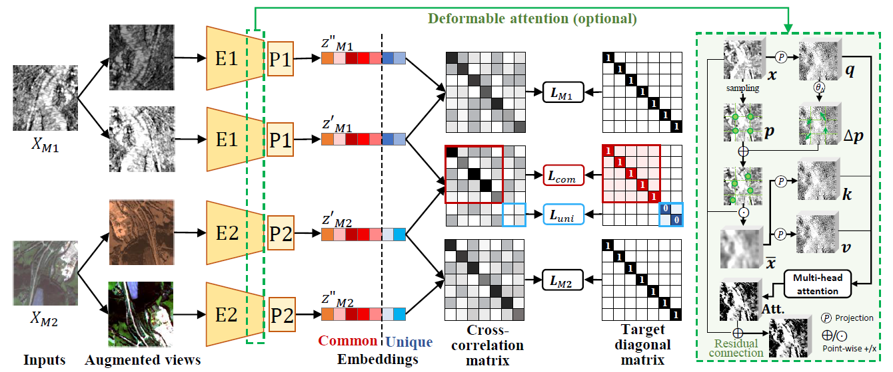

## Decoupling Common and Unique Representations for Multimodal Self-supervised Learning


<p align="center">
  
</p>

PyTorch implementation of [DeCUR](https://arxiv.org/abs/2309.05300). *This is the camera-ready version for ECCV 2024; see the branch `decur-old` for the older version. The core design remains the same, with additional deformable attention for ConvNet backbones and more experiments.*


### Pretrained models

| Modality | Pretrain dataset | Deformable Attention  | Full checkpoint | Backbone only |
| :---: | :---: | :---: | :---: | :---: | 
SAR-MS | [SSL4EO-S12](https://github.com/zhu-xlab/SSL4EO-S12) | ❌ | [RN50-SAR/MS-ep100](https://huggingface.co/wangyi111/DeCUR/resolve/main/rn50_ssl4eo-s12_joint_decur_ep100.pth) | [RN50-SAR](https://huggingface.co/wangyi111/DeCUR/resolve/main/rn50_ssl4eo-s12_sar_decur_ep100.pth), [RN50-MS](https://huggingface.co/wangyi111/DeCUR/resolve/main/rn50_ssl4eo-s12_ms_decur_ep100.pth) |
SAR-MS | [SSL4EO-S12](https://github.com/zhu-xlab/SSL4EO-S12) | ✅ | [RN50-RDA-SAR/MS-ep100](https://huggingface.co/wangyi111/DeCUR/resolve/main/rn50_rda_ssl4eo-s12_joint_decur_ep100.pth) | [RN50-RDA-SAR](https://huggingface.co/wangyi111/DeCUR/resolve/main/rn50_rda_ssl4eo-s12_sar_decur_ep100.pth), [RN50-RDA-MS](https://huggingface.co/wangyi111/DeCUR/resolve/main/rn50_rda_ssl4eo-s12_ms_decur_ep100.pth) |
SAR-MS | [SSL4EO-S12](https://github.com/zhu-xlab/SSL4EO-S12) | ❌ | [ViTS16-SAR/MS-ep100](https://huggingface.co/wangyi111/DeCUR/resolve/main/vits16_ssl4eo-s12_joint_decur_ep100.pth) | [ViTS16-SAR](https://huggingface.co/wangyi111/DeCUR/resolve/main/vits16_ssl4eo-s12_sar_decur_ep100.pth), [ViTS16-MS](https://huggingface.co/wangyi111/DeCUR/resolve/main/vits16_ssl4eo-s12_ms_decur_ep100.pth) |
RGB-DEM | [GeoNRW](https://ieee-dataport.org/open-access/geonrw)* | ❌ | [RN50-RGB/DEM-ep100](https://huggingface.co/wangyi111/DeCUR/resolve/main/rn50_geonrw_joint_decur_ep100.pth) | [RN50-RGB](https://huggingface.co/wangyi111/DeCUR/resolve/main/rn50_geonrw_rgb_decur_ep100.pth), [RN50-DEM](https://huggingface.co/wangyi111/DeCUR/resolve/main/rn50_geonrw_dem_decur_ep100.pth) |
RGB-DEM | [GeoNRW](https://ieee-dataport.org/open-access/geonrw)* | ✅ | [RN50-RDA-RGB/DEM-ep100](https://huggingface.co/wangyi111/DeCUR/resolve/main/rn50_rda_geonrw_joint_decur_ep100.pth) | [RN50-RDA-RGB](https://huggingface.co/wangyi111/DeCUR/resolve/main/rn50_rda_geonrw_rgb_decur_ep100.pth), [RN50-RDA-DEM](https://huggingface.co/wangyi111/DeCUR/resolve/main/rn50_rda_geonrw_dem_decur_ep100.pth) |
RGB-DEM | [GeoNRW](https://ieee-dataport.org/open-access/geonrw)* | ❌ | [ViTS16-RGB/DEM-ep100](https://huggingface.co/wangyi111/DeCUR/resolve/main/vits16_geonrw_joint_decur_ep100.pth) | [ViTS16-RGB](https://huggingface.co/wangyi111/DeCUR/resolve/main/vits16_geonrw_rgb_decur_ep100.pth), [ViTS16-DEM](https://huggingface.co/wangyi111/DeCUR/resolve/main/vits16_geonrw_dem_decur_ep100.pth) |
RGB-depth | [SUNRGBD](https://rgbd.cs.princeton.edu/)* | ❌ |[MiTB2-RGB/HHA-ep200](https://huggingface.co/wangyi111/DeCUR/resolve/main/mitb2_sunrgbd_rgb_hha_decur_ep200.pth) | [MiTB2-RGB](https://huggingface.co/wangyi111/DeCUR/resolve/main/mitb2_sunrgbd_backbone_rgb_decur_ep200.pth), [MiTB2-HHA](https://huggingface.co/wangyi111/DeCUR/resolve/main/mitb2_sunrgbd_backbone_hha_decur_ep200.pth) |
RGB-depth | [SUNRGBD](https://rgbd.cs.princeton.edu/)* | ❌ |[MiTB5-RGB/HHA-ep200](https://huggingface.co/wangyi111/DeCUR/resolve/main/mitb5_sunrgbd_rgb_hha_decur_ep200.pth) | [MiTB5-RGB](https://huggingface.co/wangyi111/DeCUR/resolve/main/mitb5_sunrgbd_backbone_rgb_decur_ep200.pth), [MiTB5-HHA](https://huggingface.co/wangyi111/DeCUR/resolve/main/mitb5_sunrgbd_backbone_hha_decur_ep200.pth) |

**Performance gain when transferring these RGB-DEM/RGB-depth models to other very different downstream datasets may not be significant without additional care, as the pretraining datasets were designed for supervised tasks and are limited in scale and diversity.*


### DeCUR Pretraining

Clone the repository and install the dependencies based on `requirements.txt`. Customize your multimodal dataset and your preferred model backbone in `src/datasets/`, `src/models/` and `src/pretrain_mm.py`, and run 

```
python pretrain_mm.py \
--dataset YOUR_DATASET \
--method PRETRAIN_METHOD \
--data1 /path/to/modality1 \
--data2 /path/to/modality2 \
--mode MODAL1 MODAL2 \
...
```

Apart from DeCUR, we also support multimodal pretraining with [SimCLR](https://arxiv.org/abs/2002.05709), [CLIP](https://arxiv.org/abs/2103.00020), [BarlowTwins](https://arxiv.org/abs/2103.03230v3) and [VICReg](https://arxiv.org/abs/2105.04906).

If you are using distributed training with slurm, we provide some example job submission scripts in `src/scripts/pretrain`.

### Transfer Learning

*See the corresponding `readme.md` in the `datasets` folders of the SAR-optical/RGB-DEM transfer learning tasks for dataset preparation instructions. To be updated.*

Multilabel scene classification with ResNet50 on [BigEarthNet-MM](https://arxiv.org/abs/2105.07921):

```
$ cd src/transfer_classification_BE
$ python linear_BE_resnet.py --backbone resnet50 --mode s1 s2 --pretrained /path/to/pretrained_weights ...
```

Semantic segmentation with simple [FCN](https://arxiv.org/abs/1411.4038) on [GeoNRW](https://ieee-dataport.org/open-access/geonrw):

```
$ cd src/transfer_segmentation_GEONRW
$ python GeoNRW_MM_FCN_RN50.py --backbone resnet50 --mode RGB DSM mask --pretrained /path/to/pretrained_weights ...
```

Semantic segmentation with [CMX](https://arxiv.org/abs/2203.04838) on [SUNRGBD](https://rgbd.cs.princeton.edu/) and [NYUDv2](https://cs.nyu.edu/~silberman/datasets/nyu_depth_v2.html): 

```
$ cd src/transfer_segmentation_SUNRGBD
$ python convert_weights.py # convert pretrained weights to CMX format

Then refer to https://github.com/huaaaliu/RGBX_Semantic_Segmentation for dataset preparation, training etc.
Simply load the pretrained weights from our pretrained models. 
```

### License

This project is licensed under the Apache 2.0 License - see the [LICENSE](LICENSE) file for details.


### Citation
```BibTeX
@article{wang2024decoupling,
  title={Decoupling Common and Unique Representations for Multimodal Self-supervised Learning},
  author={Yi Wang and Conrad M Albrecht and Nassim Ait Ali Braham and Chenying Liu and Zhitong Xiong and Xiao Xiang Zhu},
  journal={arXiv preprint arXiv:2309.05300},
  year={2024}
}
```
