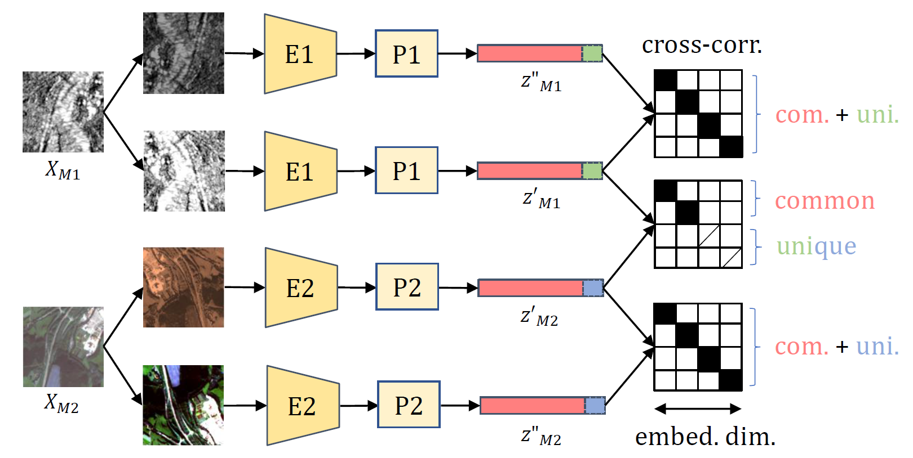

## DeCUR: decoupling common & unique representations for multimodal self-supervision.


<p align="center">
  
</p>

PyTorch implementation of [DeCUR]().


### Pretrained models

| Pretrain dataset | Full model | Backbone only |
| :---: | :---: | :---: |
| [SSL4EO-S12](https://arxiv.org/abs/2211.07044) | [ResNet50-SAR/MS-ep100](https://huggingface.co/wangyi111/DeCUR/resolve/main/rn50_ssl4eo-s12_s1_s2c_decur_ep100.pth) | |
| [GeoNRW](https://ieee-dataport.org/open-access/geonrw) | [ResNet50-RGB/DEM-ep100](https://huggingface.co/wangyi111/DeCUR/resolve/main/rn50_geonrw_rgb_dem_decur_ep100.pth) | |
| [SUNRGBD](https://rgbd.cs.princeton.edu/) | [MiTB2-RGB/HHA-ep200](https://huggingface.co/wangyi111/DeCUR/resolve/main/mitb2_sunrgbd_rgb_hha_decur_ep200.pth) | [MiTB2-RGB](https://huggingface.co/wangyi111/DeCUR/resolve/main/mitb2_sunrgbd_backbone_rgb_decur_ep200.pth), [MiTB2-HHA](https://huggingface.co/wangyi111/DeCUR/resolve/main/mitb2_sunrgbd_backbone_hha_decur_ep200.pth) |
| [SUNRGBD](https://rgbd.cs.princeton.edu/) | [MiTB5-RGB/HHA-ep200](https://huggingface.co/wangyi111/DeCUR/resolve/main/mitb5_sunrgbd_rgb_hha_decur_ep200.pth) | [MiTB5-RGB](https://huggingface.co/wangyi111/DeCUR/resolve/main/mitb5_sunrgbd_backbone_rgb_decur_ep200.pth), [MiTB5-HHA](https://huggingface.co/wangyi111/DeCUR/resolve/main/mitb5_sunrgbd_backbone_hha_decur_ep200.pth) |


### DeCUR Pretraining

Customize your multimodal dataset and your preferred model backbone in `src/datasets/`, `src/models/` and `src/pretrain_mm.py`, and run 

```
python pretrain_mm.py \
--dataset YOUR_DATASET \
--method PRETRAIN_METHOD \
--data1 /path/to/modality1 \
--data2 /path/to/modality2 \
--mode MODAL1 MODAL2 
```

Apart from DeCUR, we also support multimodal pretraining with [SimCLR](https://arxiv.org/abs/2002.05709), [CLIP](https://arxiv.org/abs/2103.00020), [BarlowTwins](https://arxiv.org/abs/2103.03230v3) and [VICReg](https://arxiv.org/abs/2105.04906).

If you are using distributed training with slurm, we provide some example job submission scripts in `src/scripts/pretrain`.

### Transfer Learning

Multilabel scene classification with ResNet50 on [BigEarthNet-MM](https://arxiv.org/abs/2105.07921):

```
$ cd src/transfer_classification_BE
$ python linear_BE.py --backbone resnet50 --mode s1 s2 --pretrained /path/to/pretrained_weights
```

Semantic segmentation with [FCN](https://arxiv.org/abs/1411.4038) on [GeoNRW](https://ieee-dataport.org/open-access/geonrw):

```
$ cd src/transfer_segmentation_GEONRW
$ python GeoNRW_MM_FCN_RN50.py --backbone resnet50 --mode RGB DSM mask --pretrained /path/to/pretrained_weights
```

Semantic segmentation with [CMX](https://arxiv.org/abs/2203.04838) on [SUNRGBD](https://rgbd.cs.princeton.edu/) and [NYUDv2](https://cs.nyu.edu/~silberman/datasets/nyu_depth_v2.html): 

```
$ cd src/transfer_segmentation_SUNRGBD
$ python convert_weights.py # convert pretrained weights to CMX format

Then please refer to https://github.com/huaaaliu/RGBX_Semantic_Segmentation.
Simply load the pretrained weights from our pretrained models. 
```

### License

This project is licensed under the MIT License - see the [LICENSE](LICENSE) file for details.


### Citation
